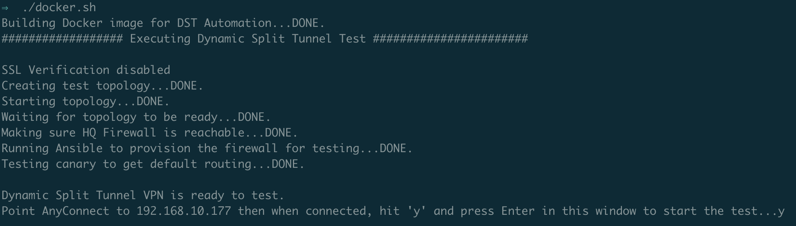
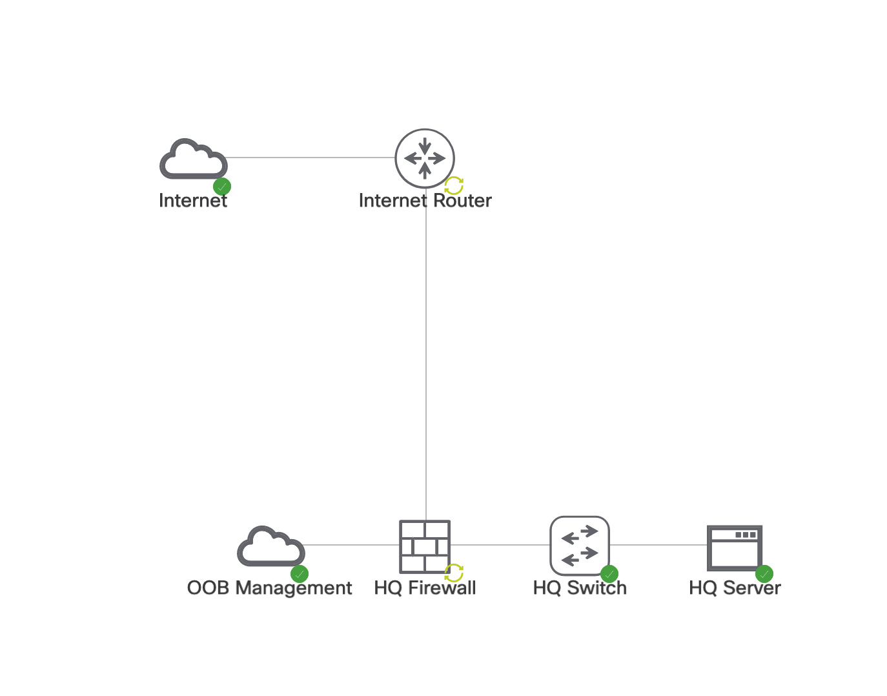
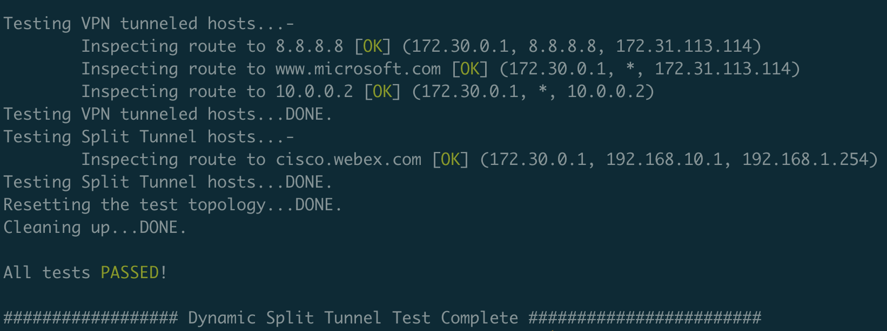

# Dynamic Split Tunneling Automation

## Introduction

When you're working from remote, you want to make sure you have a secure connection back to your office and to the corporate resources you need to do your job.  Therefore, many corporate IT organizations insist that all remote traffic is tunneled over a VPN.  Today, due to COVID-19, there are _so_ many users working remotely that pushing all remote traffic over the VPN can and is overwhelming the corporate bandwidth and the VPN headends.

Features like split tunneling exist to designate that traffic to some hosts or networks flows over the VPN while traffic to other hosts and networks is routed locally (i.e., outside of the VPN).  This is all fine and good when you know those IP address blocks.  But what about the cloud-based services many of us are using today?  Often times they use a swath of IP addresses that are load balanced across a large cloud infrastructure.  It's only when those IP addresses are used with a given DNS name do they actually mean, "do service X" vs. "do service Y".

Fortunately, Cisco's Adaptive Security Appliance (ASA) and its AnyConnect client offer a feature called **Dynamic Split Tunneling** (DST) that allows an administrator to specify a set of DNS domains that can be routed locally.  Thus, administrators can keep traffic to heavier cloud services like Webex or Office 365 off of the VPN since those services are trusted and already protected with TLS.  The result is more capacity for all remote users through the VPN.

You can read more on DST, its benefits, and how it's configured in this [blog](https://community.cisco.com/t5/security-documents/anyconnect-split-tunneling-local-lan-access-split-tunneling/ta-p/4050866#toc-hId--352692823).


## DST Automation

This repository contains code that one can use to test and deploy Dynamic Split Tunneling configuration changes using [Cisco Modeling Labs](https://developer.cisco.com/modeling-labs) (CML) and [Ansible](https://www.ansible.com).  The code does the following:

1. Spins up a [Docker](https://www.docker.com) container
2. Creates a test topology in CML
3. Waits for the topology to fully boot
4. Invokes Ansible to configure DST based on a YAML config file
5. Prompts the user to connect with AnyConnect
6. Runs tests to make sure the config does the right thing
7. Tears down the test topology
8. Optionally deploys the config to production if all tests pass

To get started, make sure you have Docker installed on your host.  ***Note:*** DST is not supported on the Linux AnyConnect client, so you'll need to run this from a Mac or Windows machine.

Next, copy the `config.yaml.tmpl` file to `config.yaml` in the same directory.  Edit this file to adjust necessary variables.  Notably, fill in the IP address, user, and password for your CML deployment under the `cml` section.

In the `test` section, change the `firewall_ip` address to be an address that is in the same subnet as your CML VM, but is not currently used.  This will be the address you assign to the out of band management interface of the test ASA firewall.  This ASA firewall may need to be temporarily licensed in order to ensure it can build enough connections.  Fill in your Smart License token for `smart_license_token` for an account that has an ASAv license.  As part of Cisco's COVID-19 response, free licenses can be obtained from [here](https://www.cisco.com/c/m/en_us/covid19.html).  If you think the 100 connection limit will be fine, just comment out this line by putting a # in front of the `smart_license_token` line.  Modify the `local_hosts` parameter so that you list one or more hosts to which traffic will be routed locally once DST is in effect.  Under `tunnel_hosts` list hosts that should still be tunneled over the VPN even with DST in effect.  No other parameters need to be modified.

In the `dst` section, modify the `domains` parameter to list out the domains you want to exclude from the VPN.  If you want to use a different parameter name than "exclude_domains" you can specify that for the `custom_name` parameter.

Finally, if you want to deploy into production, under the `production` section, set `ansible_user` to your production ASA(s) username, `ansible_password` to your production ASA(s) password, set `ansible_become_password` to your production ASA(s) enable password, fill in the group policy or policies for which you want to enable DST under `group_policies`, and list your production firewalls under the `firewalls` parameter.

Next, modify the `base_configs/hq_firewall.txt` file and search for "CHANGE ME!" (there will be two of these).  You'll need to change the IP address on the Management0/0 interface to the same address you specified above for `firewall_ip`.  And change `192.168.10.0 255.255.255.0` access-list element to be the same subnet as the `firewall_ip` is in above.

## Running the Code

To just run the test and not to any production deployment, run:

```sh
$ ./docker.sh
```

The output will look something like:



The test run will pause here waiting for you to point your macOS or Windows AnyConnect client to the virtual ASA in the test topology.  The default username firewall from its base config is **home-user** and the default password is **cisco123**.  If you modify the `base_configs/hq_firewall.txt` file to use another account, be sure to specify those credentials when connecting with AnyConnect.

At this point, the following topology is created and running within CML:

Once connected, return to the terminal window and type *y* and press Enter to initiate the traffic tests.  The tests run through the set of hosts configured in `config.yaml` and perform ICMP traceroutes to ensure the first three hops indicate either VPN use or local routing (depending on the host).  The output will look something like:



If a test fails it will print a warning for that test and a final message will indicate that at least one test failed.

## Deploying To Production

Now that you've seen a test run, you can re-run the `docker.sh` command with the `-deploy` argument to deploy the code to production once all of the tests pass.

```sh
$ ./docker.sh -deploy
```

